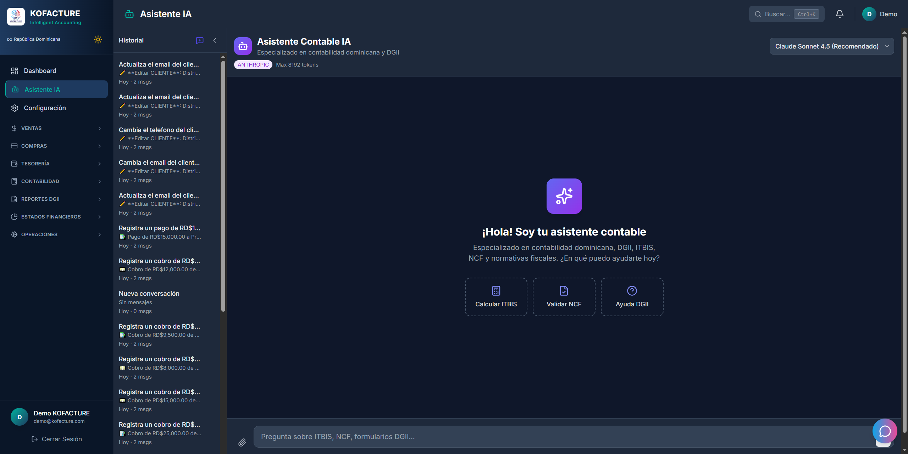
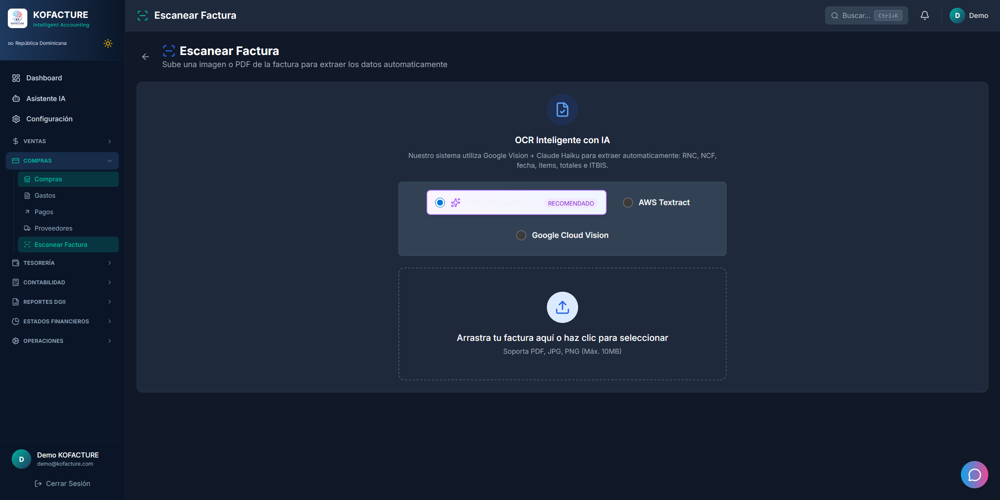
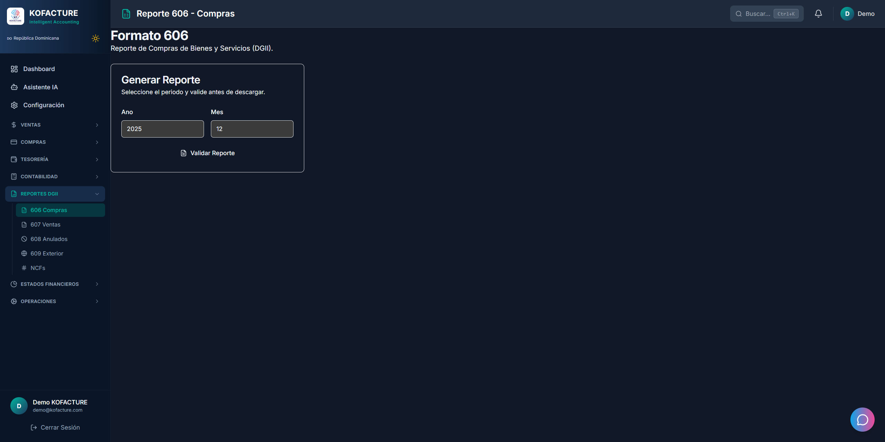
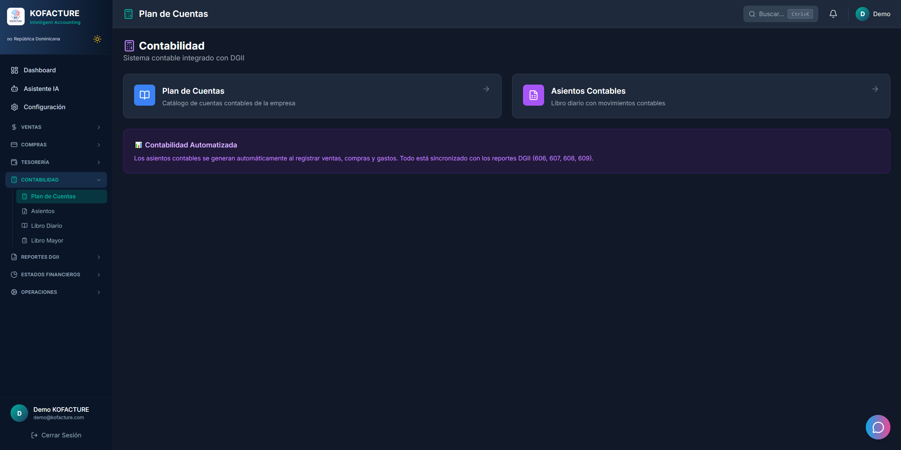
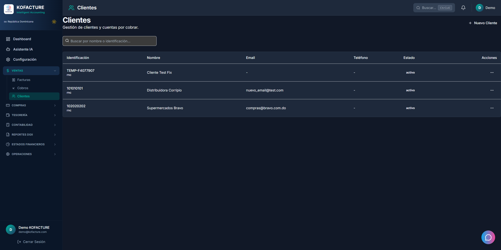
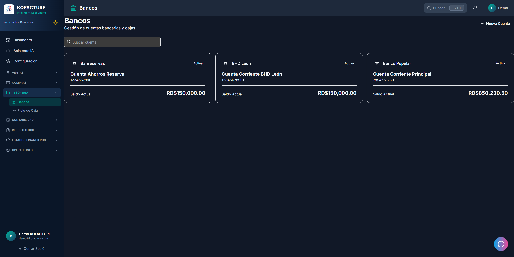
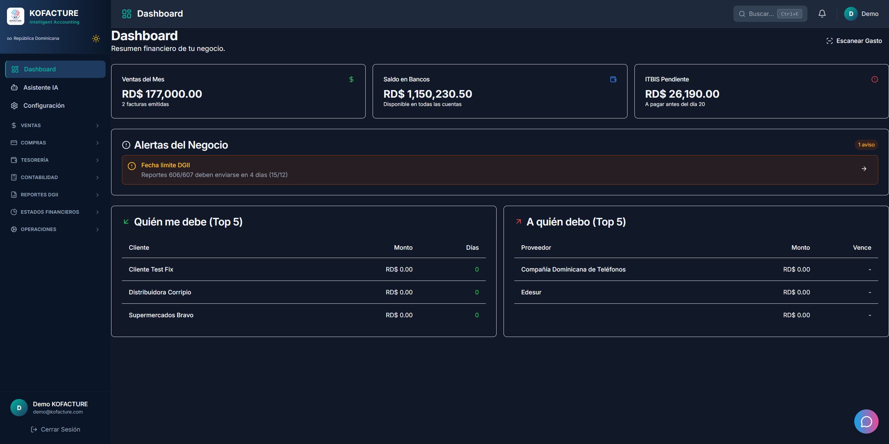

# KOFACTURE - AI-Powered Accounting Platform


[](/)
[](/)
[](/)

> **Full-stack SaaS accounting platform with AI assistant, OCR invoice scanning, and government tax compliance. Built in under 30 days.**

---

## Overview

KOFACTURE is a complete cloud-based accounting system designed for businesses in the Dominican Republic. It features an AI-powered assistant, automatic invoice scanning with OCR, electronic invoicing (e-CF), and full compliance with local tax regulations.

### Key Highlights

- **AI Conversational Assistant** - Natural language queries about finances, taxes, and reports
- **OCR Invoice Scanning** - Upload photos/PDFs, get structured data in seconds
- **Multi-tenant Architecture** - Support for accountants managing multiple businesses
- **Government Compliance** - Full DGII tax reporting (606, 607, 608, 609 formats)
- **Electronic Invoicing** - e-CF integration with certified providers
- **Real-time Dashboard** - Financial metrics and business intelligence

---

## Screenshots

### Dashboard

*Real-time financial overview with key metrics and alerts*

### AI Assistant

*Ask questions in natural language, get instant answers*

### Sales & Invoicing

*Complete invoicing system with electronic invoicing (e-CF)*

### OCR Invoice Scanner

*Upload any invoice photo, extract data automatically*

### Tax Reports (DGII 606)

*One-click generation of government-required reports*

### Accounting

*Chart of accounts and journal entries*

### API Documentation

*100+ RESTful endpoints with Swagger documentation*

### Client Management

*Complete CRM for managing customers and vendors*

### Treasury & Banking

*Bank accounts, payments, and cash flow management*

### Authentication

*Secure JWT-based authentication system*

---

## Tech Stack

### Backend
| Technology | Purpose |
|------------|---------|
| **FastAPI** | High-performance Python API framework |
| **SQLAlchemy 2.0** | Modern ORM with async support |
| **PostgreSQL** | Primary database |
| **JWT + bcrypt** | Secure authentication |
| **Celery + Redis** | Background job processing |

### Frontend
| Technology | Purpose |
|------------|---------|
| **Next.js 14** | React framework with App Router |
| **TypeScript** | Type-safe development |
| **Tailwind CSS** | Utility-first styling |
| **shadcn/ui** | Modern component library |
| **TanStack Query** | Server state management |

### AI & Integrations
| Technology | Purpose |
|------------|---------|
| **OpenAI GPT-4** | Conversational AI assistant |
| **Google Gemini Vision** | OCR invoice scanning |
| **Alanube API** | Electronic invoicing (e-CF) |
| **Stripe** | Payment processing |

---

## Features

### AI Assistant
The AI assistant understands natural language and has full context of your financial data:

```
User: "How much do I owe in taxes this month?"

AI: Based on your November transactions:
    • Sales Tax Collected: $2,512.00
    • Tax Credits (purchases): $1,847.00
    • Net Tax Due: $665.00

    You have 3 invoices pending registration that could
    increase your tax credits by approximately $120.
```

### OCR Invoice Scanning
Upload any invoice photo or PDF and get structured data instantly:

- **Supported formats**: JPG, PNG, PDF
- **Extracted fields**: Vendor info, tax ID, line items, totals, tax amounts
- **Accuracy**: 95%+ for standard invoices
- **Processing time**: < 3 seconds

### Multi-tenant Support
Perfect for accounting firms managing multiple clients:

- **Role-based access**: Admin, Accountant, Viewer
- **Company switching**: Seamless navigation between client accounts
- **Audit trails**: Complete activity logging
- **Data isolation**: Strict separation between tenants

### Tax Compliance Reports
One-click generation of required government reports:

| Report | Description |
|--------|-------------|
| **606** | Purchase transactions |
| **607** | Sales transactions |
| **608** | Voided invoices |
| **609** | Foreign payments |

---

## Architecture

```
┌─────────────────────────────────────────────────────────────────┐
│                         FRONTEND                                 │
│                    Next.js 14 + TypeScript                       │
│              ┌─────────────────────────────────┐                │
│              │  Dashboard │ AI Chat │ Reports  │                │
│              └─────────────────────────────────┘                │
└─────────────────────────────────────────────────────────────────┘
                              │
                              ▼
┌─────────────────────────────────────────────────────────────────┐
│                          BACKEND                                 │
│                     FastAPI + Python                             │
│  ┌──────────┐  ┌──────────┐  ┌──────────┐  ┌──────────┐        │
│  │   Auth   │  │ AI Agent │  │   OCR    │  │ Reports  │        │
│  └──────────┘  └──────────┘  └──────────┘  └──────────┘        │
│  ┌──────────┐  ┌──────────┐  ┌──────────┐  ┌──────────┐        │
│  │  Sales   │  │ Purchases│  │ Treasury │  │Accounting│        │
│  └──────────┘  └──────────┘  └──────────┘  └──────────┘        │
└─────────────────────────────────────────────────────────────────┘
                              │
          ┌───────────────────┼───────────────────┐
          ▼                   ▼                   ▼
    ┌──────────┐        ┌──────────┐        ┌──────────┐
    │PostgreSQL│        │  Redis   │        │  Celery  │
    │ Database │        │  Cache   │        │  Queue   │
    └──────────┘        └──────────┘        └──────────┘
                              │
          ┌───────────────────┼───────────────────┐
          ▼                   ▼                   ▼
    ┌──────────┐        ┌──────────┐        ┌──────────┐
    │  OpenAI  │        │  Gemini  │        │ Alanube  │
    │  GPT-4   │        │  Vision  │        │   e-CF   │
    └──────────┘        └──────────┘        └──────────┘
```

---

## API Endpoints

The backend exposes **100+ RESTful endpoints** organized by module:

| Module | Endpoints | Description |
|--------|-----------|-------------|
| `/auth` | 5 | Authentication & authorization |
| `/sales` | 14 | Invoices, NCF sequences, e-CF |
| `/purchases` | 8 | Vendor invoices, expenses |
| `/accounting` | 17 | Chart of accounts, journal entries |
| `/treasury` | 19 | Banks, payments, cash flow |
| `/reports` | 16 | Tax reports, financial statements |
| `/ocr` | 4 | Invoice scanning & extraction |
| `/ai` | 3 | AI assistant conversations |

---

## Development Timeline

This project was built in **under 30 days** as a solo developer:

| Week | Deliverables |
|------|--------------|
| **Week 1** | Database schema, auth system, core API |
| **Week 2** | Frontend dashboard, sales/purchase modules |
| **Week 3** | AI integration, OCR scanning, tax reports |
| **Week 4** | Multi-tenant support, polish, testing |

---

## Security

- **Authentication**: JWT tokens with refresh rotation
- **Password hashing**: bcrypt with salt
- **Rate limiting**: Protection against brute force
- **Input validation**: Pydantic models + Zod schemas
- **SQL injection**: ORM-only queries
- **XSS protection**: React automatic escaping
- **CORS**: Configurable allowed origins

---

## Performance

- **API response time**: < 100ms average
- **OCR processing**: < 3 seconds
- **AI responses**: < 2 seconds
- **Dashboard load**: < 1.5 seconds
- **Database queries**: Optimized with indexes

---

## Contact

**Paul** - Full-Stack Developer

- Expertise: Python, TypeScript, AI/ML integrations
- Available for: Freelance projects, consulting
- Timeline: Can deliver complex SaaS in 30 days

---

## Documentation

Detailed technical documentation:

| Document | Description |
|----------|-------------|
| [Architecture](ARCHITECTURE.md) | System design, database schema, security layers |
| [AI Features](AI_FEATURES.md) | AI assistant, OCR pipeline, function calling |
| [API Reference](API_REFERENCE.md) | 100+ endpoints with examples |
| [Project Management](PROJECT_MANAGEMENT.md) | PMI framework, sprints, WBS, risk management |
| [Portfolio Guide](PORTFOLIO_GUIDE.md) | How to create a stellar portfolio repository |

---

## Project Stats

```
┌────────────────────────────────────────────────────────────────┐
│                    PROJECT METRICS                              │
├────────────────────────────────────────────────────────────────┤
│                                                                 │
│   📁 Backend (Python)                                          │
│      ├── 11 modules                                            │
│      ├── 100+ API endpoints                                    │
│      ├── 23 database migrations                                │
│      └── 35+ test files                                        │
│                                                                 │
│   🎨 Frontend (TypeScript)                                     │
│      ├── 43 pages                                              │
│      ├── 87 components                                         │
│      └── Full dark/light theme                                 │
│                                                                 │
│   🤖 AI Integration                                            │
│      ├── OpenAI GPT-4 (Assistant)                              │
│      ├── Google Gemini Vision (OCR)                            │
│      └── 15+ function tools                                    │
│                                                                 │
│   📊 Database                                                  │
│      ├── 25+ tables                                            │
│      ├── Multi-tenant isolation                                │
│      └── Row-level security                                    │
│                                                                 │
└────────────────────────────────────────────────────────────────┘
```

---

## Why This Project Matters

This project demonstrates:

1. **Full-Stack Expertise** - Complete system from database to UI
2. **AI Integration** - Production-ready LLM with function calling
3. **Domain Complexity** - Tax regulations, accounting standards, compliance
4. **Speed of Delivery** - Complex SaaS in under 30 days
5. **Enterprise Patterns** - Multi-tenancy, audit trails, security

---

## License

This project is proprietary software. Screenshots and documentation may be shared for portfolio purposes.

---

*Built with modern technologies and AI-powered features. Designed for scalability and compliance.*